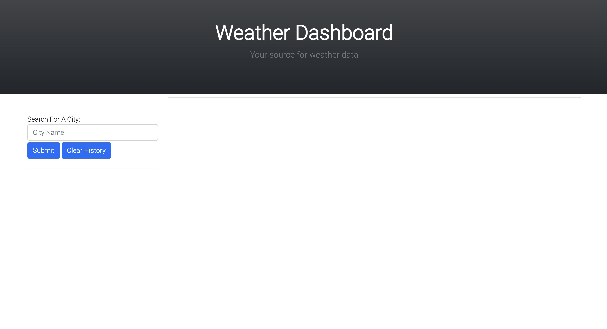
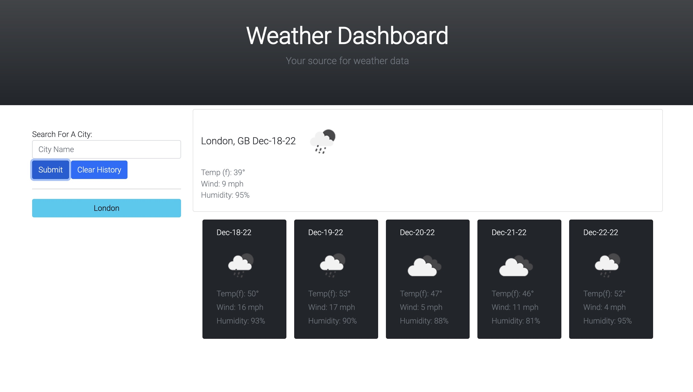
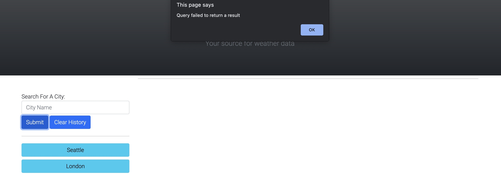
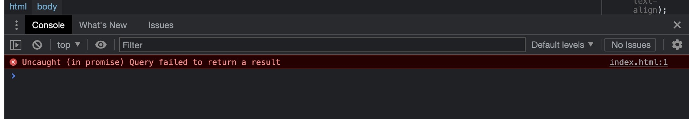

# Challenge 06: Weather App - Due Dec 19, 2022

## Introduction

The purpose of this challenge was to familiarize me with server-side apis, and continue to practice using JavaScript effectively.

## Techniques Used

I employed the use of a multitude of methods to deploy server side apis, including using the fetch and then, and a multitude of other apis for dom traversal.

## Examples of Use

Upon load, users are presented with a search box that allows them to enter a city and search for the current and forecasted weather:

When the user executes a search, their search is saved locally and in a series of buttons that can rerun the search:

Users can clear the search history using the clear-history button which will clear all the buttons as well as the local storage.

If the user inputs a search that doesn't return any results from the lat/lon api, it will return a window message indicating an error and won't save the invalid search to the search history button lis:

In this instance, and error message will also be printed to the console:

## Link to Deployed Application

<a href="https://harryhamlin.github.io/weatherapp/">https://harryhamlin.github.io/weatherapp/</a>